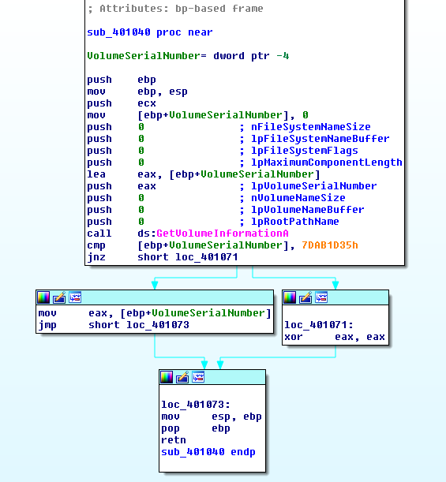

# Challenge 2

Download the challenge binary from [DudeLocker.exe](DudeLocker.exe) and [BusinessPapers.doc](BusinessPapers.doc).

## Start

### Overview
Judging from the name of the binaries, we can immediately deduce that this challenge is imitating some sort of ransomware. DudeLocker is probably a play on the Cryptolocker name.

Similarly, lets find out more information on the binary.

```
$ file *
BusinessPapers.doc: data
DudeLocker.exe:     PE32 executable for MS Windows (console) Intel 80386 32-bit
```

Although BusinessPapers.doc has a `.doc` extension, it seems to really be just some data. 

Once again, lets begin reversing by throwing `DudeLocker.exe` into IDA.

Lets jump straight to the main function starting at **0x4019A0**.

This time it doesn't appear to be as straightforward as challenge 1, there is no clear identication of where we need to direct the execution towards. As such, lets proceed step by step to gain some insights to what is going on.

#### First-branch - SHGetFolderPathW

Going into the callgraph view, we see that the first branch is dependent on the result from `call ds:SHGetFolderPathW`. 

We can get more information on the function from https://msdn.microsoft.com/en-us/library/windows/desktop/bb762181(v=vs.85).aspx and http://www.installmate.com/support/im9/using/symbols/functions/csidls.htm.

The left branch seems to be doing nothing, whereas the right branch leads to more instruction. Likely we want the execution to jump into the right branch.

#### Second-branch - lstrlenW

The second branch is straightforward, checks the strlen of a String to be less than **0xF8**.

Similar to the first-branch, we want execution to jump into the right branch based on the conditional.

#### Third-branch - CreateFileW

The third branch is again dependent on the results from the CreateFile call. But before we delve into that, we see that there is a function call to a user defined function located at **0x401000**.

##### Activity - 10 minutes
**[Activity]** Find out what the user defined function is doing.

**[Activity]** Find out how to get execution to go into the right branch.  
***Hint: Make use of a debugger to verify***

#### Fourth-branch - Function at 0x401040

Again, we see that the branch is dependent on the result of the user-defined function located at 0x401040. What we are trying to achieve here is for the result to be not equal to 0 so that execution would take the right branch.

Let's jump into the user-defined function and see what it is doing.

The **eax** register is commonly used to contain return values from function calls. In this case, we are trying to achieve a state where the **eax** register has a non-zero value at the end of the function.



Based on the callgraph view, we are trying to reach the state where the contents of `ebp+VolumeSerialNumber` is moved into **eax**.

##### Activity - 5 minutes
**[Activity]** Determine what GetVolumeInformation is doing.

Now that we know what the GetVolumeInformation function call is doing, there are two ways to bypass this check.

1. Patching this segment of instructions to always return the expected value. Learn how to do so [here](http://marcoramilli.blogspot.sg/2011/01/how-to-patch-binary-with-ida-pro.html).
2. Modify your system to return the correct values to pass the check.

##### Activity - 10 minutes
**[Activity]** Reach the state where **eax** is non-zero.

#### Fifth-branch - Function at 0x401080
Here's where things starts to get a little exciting :D

The start of the basic block does not seem to be very interesting. All it does is to allocate a chunk of heap.

Let's jump straight to the next user-defined function at **0x401940**.

Before we look at what the function is doing, lets identify what its parameters are.

##### Activity - 10 minutes
**[Activity]** Which of its parameters are user-influenced?

Let's now dive into the function.

**[Activity]** Is the function doing anything interesting? What is the contents in the heap chunk after the function call?

What about the next user-defined function at **0x401080**?

We see that there are calls to many native functions, what does each of them do?

- CryptAcquireContext - [https://msdn.microsoft.com/en-us/library/windows/desktop/aa379886(v=vs.85).aspx]("https://msdn.microsoft.com/en-us/library/windows/desktop/aa379886(v=vs.85).aspx")
- GetLastError
- CryptReleaseContext
- CryptSetKeyParam

We see that the first CryptAcquireContext call has the following parameters:
- dwFlags = 0
- dwProvType = 0x18
- szProvider = 0
- szContainer = 0
- phProv = ?

**[Activity]** What type of provider types is being used here?

Lets move on to address **0x4010ce** of the function.

Again, there's a call to a user-defined function located at **0x401180**.

Here's the list of parameters for the function:

1. phKey
2. hProv
3. AlgId = 0x6610
4. pbData = `"thosefilesreallytiedthefoldertogether"`
5. dwDataLen = 0x25

Let's jump into the function.

We see more calls to native functions:

- CryptCreateHash
- CryptHashData
- CryptDeriveKey
- CryptDestroyHash

**[Activity]** What are the parameters and their purpose for the CryptCreateHash call?

1. hProv
2. Algid
3. hKey
4. dwFlags
5. phHash

**[Activity]** Since we know that **CryptHashData** is used for hashing, what is the hashing algorithm used here?

We see that the results from **CryptHashData** is used in the **CryptDeriveKey** call.

**[Activity]** What is the Cryptographic Algorithm in the CryptDeriveKey call?

Seems like we now know what this entire function is trying to do. :)

##### Activity - 5 minutes

**[Activity]** Let's try executing the binary now, do you notice any interesting activity?  
Hint: You could use procmon to make your job easier. :)

Let's move on to the next branch!

#### Sixth-branch - Function at 0x401300

Seems like this function is enumerating all files in a certain directory!

Now that we know what we are looking for, we can just jump straight to the section of code where **hProv** and **hKey** is used.

It is obvious what to do next!

##### Activity - 30 minutes

**[Activity]** Decrypt **BusinessPapers.doc** to get the flag!

There are two ways to do this:

1. Write an application/script to decrypt the document.
2. Modify **CryptEncrypt** to be **CryptDecrypt**.

Note: Decryption in Python requires deriving the same secret key.

You could use the wincrypto Python library [here](https://github.com/crappycrypto/wincrypto). Result may not be perfect but allows you to get the flag. :)

The following is a snippet of Python from the original challenge author's solution that derives the same Key as in C/C++:

```
import hashlib

def derive_key(key):
 # SHA-1 hash algorithm used
 key_sha1 = hashlib.sha1(key).digest()
 b0 = ""
 for x in key_sha1:
 b0 += chr(ord(x) ^ 0x36)
 b1 = ""
 for x in key_sha1:
 b1 += chr(ord(x) ^ 0x5c)
 # pad remaining bytes with the appropriate value
 b0 += "\x36"*(64 - len(b0))
 b1 += "\x5c"*(64 - len(b1))
 b0_sha1 = hashlib.sha1(b0).digest()
 b1_sha1 = hashlib.sha1(b1).digest()
 return b0_sha1 + b1_sha1
 ```

 
##### Additional Activity
 
If you are done and waiting for others, you can try to find out what the rest of the application is attempting to do. ;)
 
 